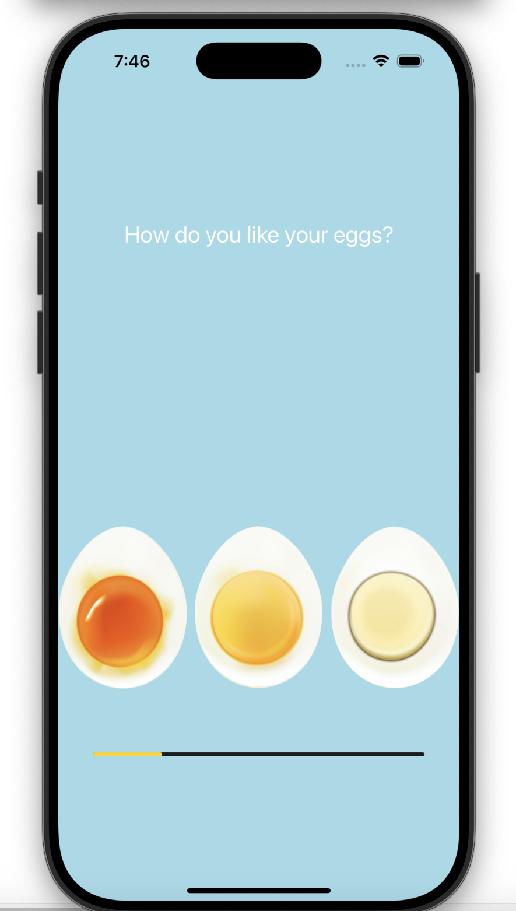

# 🥚 EggTimer - iOS App

EggTimer is a simple iOS application that allows users to select the desired egg hardness (Soft, Medium, or Hard), and notifies them with a sound once the timer completes.

---

## ⏰ Features

- Select from Soft, Medium, or Hard egg boiling presets
- Visual countdown using a `UIProgressView`
- Real-time timer updates
- Plays an alert sound when the timer completes
- Built using UIKit and AVFoundation

---

## 🛠️ Technologies Used

- **Language:** Swift
- **Frameworks:** UIKit, AVFoundation
- **UI Components:** UIButton, UILabel, UIProgressView
- **Audio:** `AVAudioPlayer`
- **Timer Logic:** `Timer.scheduledTimer`

---
## Preview 
 
___
### Prerequisites

- Xcode 13 or later
- iOS 13+ device or simulator

